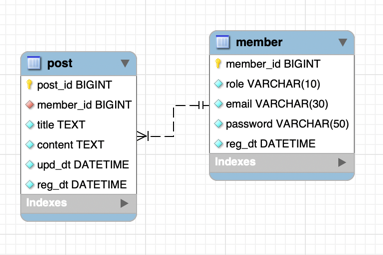

# wanted-pre-onboarding-backend

- 지원자의 성명 : 박 상 민

- 기술 스택 및 버전
  - Java : 11
  - Spring Boot : 2.7.10
  - Mysql : 8.0.33
  - Redis : 7.0.8
  
- 애플리케이션 실행 방법
  1. 도커 설치
     ```shell
     sudo apt-get update
  
     sudo apt-get install -y ca-certificates curl software-properties-common apt-transport-https gnupg  lsb-release
  
     sudo mkdir -p /etc/apt/keyrings
  
     curl -fsSL https://download.docker.com/linux/ubuntu/gpg | sudo gpg --dearmor -o /etc/apt/keyrings/docker.gpg
  
     echo "deb [arch=$(dpkg --print-architecture) signed-by=/etc/apt/keyrings/docker.gpg] https://download.docker.com/linux/ubuntu $(lsb_release -cs) stable" | sudo tee /etc/apt/sources.list.d/docker.list > /dev/null
  
     sudo apt-get update
  
     sudo apt install docker-ce docker-ce-cli containerd.io
     ```

  2. 저장소 클론
     ```shell
     git clone https://github.com/tableMinPark/wanted-pre-onboarding-backend.git
     ```

  3. 빌드
     ```shell
     # java 11 설치
     sudo apt-get install openjdk-11-jdk
     
     # 프로젝트 빌드
     cd wanted-pre-onboarding-backend
     sh build.sh
     ```
  4. redis 환경 설정
     ```shell
     # 볼륨 디렉토리 생성
     sudo mkdir -p /data/redis/conf

     # redis 설정 파일 생성
     sudo nano /data/redis/conf/redis.conf
     ```
     ```shell
     # redis.conf
     bind 0.0.0.0
     port 6379
     requirepass wanted.!
     ```
  5. 도커 컴포즈 실행
     ```shell
     # 도커 컴포즈 실행
     sudo docker compose up -d
     ```
  6. API 앤드포인트
     - 회원가입 앤드포인트
        - POST : **/auth/reguster**
     - 로그인 앤드포인트
        - POST : **/auth/login**
     - 게시물 생성 앤드포인트
        - POST : **/post**
     - 게시물 목록 조회 앤드포인트
        - GET : **/post**
     - 게시물 조회 앤드포인트
        - GET : **/post/{postId}**
     - 게시물 수정 앤드포인트
        - PUT : **/post/{postId}**
     - 게시물 삭제 앤드포인트
        - DELETE : **/post/{postId}**
  
- 데이터베이스 테이블 구조
  
  
  
- 구현한 API의 동작을 촬영한 데모 영상 링크
  
  
- 구현 방법 및 이유에 대한 간략한 설명
  - Spring Boot 기반 RESTFul API
  - 단위 테스트 코드 작성 후 서비스 로직을 구현하여, 발생할 수 있는 경우의 수를 확인하고 구현
  - Service 단에서 사용자 정의 예외를 이용해 실패 여부를 처리함
    - 리턴 값을 통해 컨트롤러에서 한번 더 값을 검증하는 과정을 생략하고 예외를 통해 실패 상황을 인자하고 ControllerAdvice 단에서 실패에 대한 응답을 처리
  - ControllerAdvice를 통해 예외를 한 곳에서 처리할 수 있도록 함
    - 추후 다른 기능을 구현할 때 사용자 정의 예외를 통해 예외 별로 응답을 처리할 수 있게 하기 위함
  - Spring Security 를 적용하여 인증/인가 부분 처리
    - 필터 레벨에서 인증/인가를 한번에 처리해서 컨트롤러 단에서 인증/인가하는 중복 코드를 제거하기 위함
    - 추후 회원 구분을 통해 회원 별 인가 정보를 따로 부여하는 기능 확장을 위함
    - 인가 없이는 접근할 수 없는 기능들은 필터 레벨에서 처리하여 서버에 부하를 미약하게 나마 줄이기 위함
  - JSend 형식의 응답처리 
    - 성공 시에는 상관없지만 실패 또는 에러 시 프론트 쪽에서 실패 또는 에러의 이유를 파악하게 하기 위함
    - 성공
      ```json
      {
        "status" : "success",
        "data" : {
          "accessToken" : "[accessToken]",
          "refreshToken" : "[refreshToken]"
        }
      }
      ```
    - 실패
      ```json
      {
        "status" : "fail",
        "data" : {
          "title" : "이메일 형식이 맞지 않음",
          "content" : "이메일 형식이 맞지 않아서 로그인할 수 없습니다."
        }
      }
      ```
    - 에러
      ```json
      {
        "status" : "error",
        "message" : "데이터베이스의 연결 실패로 로그인을 처리할 수 없습니다."
      }
      ```

- API 명세 (request/response 포함)

  | method | url            | 설명           | request                                                     | response                                                                                               |
  |--------|----------------|--------------|-------------------------------------------------------------|--------------------------------------------------------------------------------------------------------|
  | post   | /auth/register | 회원가입         | email : String<br> password : String                        | status : String<br>                                                                                    |
  | post   | /auth/login    | 로그인          | email : String<br> password : String                        | status : String<br> data : { accessToken : String, refreshToken : String }                             |
  | post   | /post          | 게시글 생성       | title : String<br> content : String                         | status : String                                                                                        |
  | get    | /post          | 게시글 목록 조회    | page : Int<br> size : Int                                   | status : String<br> data : [{ memberId : Int, title : String, regDt : LocalDateTime }]                 |
  | get    | /post/{postId} | 특정 게시글 조회    | postId : Int (Path)                                         | status : String<br> data : { memberId : Int, title : String, content : String, regDt : LocalDateTime } |
  | update | /post/{postId} | 특정 게시글 수정 | postId : Int (Path)<br> title : String<br> content : String | status : String<br>                                                                                    | 
  | delete | /post/{postId} | 특정 게시글 삭제 | postId : Int (Path)                                         | status : String<br>                                                                                    |
    
